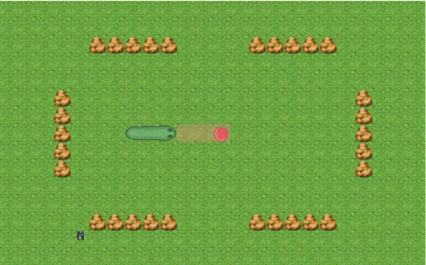

# **Giới thiệu bài Project cuối kỳ môn trí tuệ nhân tạo nhóm 9**

## Thành viên nhóm 9:
Lưu Quang Tiến - 23110157\
Trần Cẩm Long - 23110122

## **Mục tiêu của Project**
Bài Project cuối kỳ thực hiện xây dựng game Snakes! bằng ngôn ngữ Python nhằm mục đích biểu diễn cách ứng dụng các thuật toán đã được học trong việc tìm kiếm đường đi ngắn nhất để tìm mục tiêu. Từ đó tìm ra thuật toán nào phù hợp, tối ưu nhất trong việc tìm kiếm đường đi ngắn nhất đến mục tiêu trong trò chơi.

## **Mục lục**
Trong phần giới thiệu của Project, chúng em sẽ nói qua về những chủ đề sau:
- [Thư viện](#Thư-viện)
- [Giới thiệu game Snakes!](#Giới-thiệu-game-Snakes!)
- [Lý thuyết, nguyên lý cơ bản của thuật toán](#Lý-thuyết,-nguyên-lý-cơ-bản-của-thuật-toán)
- [Demo các thuật toán](#demo-các-thuật-toán)
- [Ưu điểm, nhược điểm](#ưu-điểm-nhược-điểm)
- [Kết luận](#kết-luận)

## *Thư viện*
Trong quá trình xậy dựng game, nhóm có sử dụng những thư viện không có sẵn trong python:
- pygame: thư viện cốt lõi trong quá trình thực hiện Project, cung cấp những công cụ để tạo GUI và thực hiện vòng lặp để game hoạt động.
- openpyxl: thư viện cung cấp công cụ giúp xuất dữ liệu trong quá trình sử dụng thuật toán để chạy game tự động.

## *Giới thiệu game Snakes!*
Lý do nhóm 9 lựa chọn game Snakes! hay thường biết đến là "Rắn săn mồi" là vì đây là một trò chơi phổ biến và khá quen thuộc đối với nhiều người, đồng thời cũng rất dễ để hiểu được quy trình tìm đường đi của con rắn đến thức ăn.

Luật chơi của Snakes! rất đơn giản. Người chơi điều khiển con rắn di chuyển theo 4 chiều, tương ứng với 4 nút chỉ hướng trên bàn phím, giúp con rắn ăn được quả táo để nó dài ra và giúp con rắn tránh va chạm vào các chướng ngại vật (tường, lề màn hình, và quan trọng nhất là cơ thể con rắn).

## *Lý thuyết, nguyên lý cơ bản của thuật toán*

### BFS
Thuật toán quét cạn bắt đầu từ đầu con rắn đến quả táo. Con rắn sẽ quét cạn bắt đầu từng lớp, kiểm tra đã đến đích chưa, sau đó sinh ra các trạng thái (ô) con an toàn với hàm snake.Is_safe() rồi đưa vào hàng đợi nếu chưa được duyệt qua. Sau khi tìm kiếm được mục tiêu, thuật toán sẽ xây dựng lại đường đi từ quả táo đến đầu con rắn để dẫn đường cho nó di chuyển.
Độ phức tạp trường hợp xấu nhất:
- Không gian: 24 x 15 - 30 = 330
- Thời gian: 24 x 15 - 30 = 330

### DFS
Thuật toán tìm kiếm theo chiều sâu bắt đầu từ đầu con rắn đến quả táo. Con rắn sẽ kiểm tra đã đến đích chưa, sau đó sinh ra các trạng thái (ô) con an toàn với hàm snake.Is_safe() rồi đưa vào hàng đợi nếu chưa được duyệt qua. Các ô con được duyệt qua theo FIFO (First in first out), khác với BFS quét cạn, DFS tìm kiếm theo nhánh sâu. Sau khi tìm kiếm được mục tiêu, thuật toán sẽ xây dựng lại đường đi từ quả táo đến đầu con rắn để dẫn đường cho nó di chuyển.
Độ phức tạp trường hợp xấu nhất:
- Không gian: 360
- Thời gian: 360

### UCS
Giống với BFS, thuật toán UCS cũng sử dụng phương thức quét cạn. Nhưng UCS khác biệt ở việc kèm theo chi phí g(n) cho các trạng thái. Môi trường game được đặt những khu vực với các mức độ "nguy hiểm" (+0, +1, +2, +3) và từ đó quyết định được đường đi cuối dùng ngắn và an toàn nhất cho con rắn.
Độ phức tạp trường hợp xấu nhất:
- Không gian: 360
- Thời gian: 360log(360)

## Greedy
Khác với những thuật toán trước, Greedy sử dụng heuristic h(n) để tìm đường đi tốt nhất tại thời điểm đó và đi đến quả táo. Trong Project, heuristic được kết hợp giữa 3 hàm tính toán. Flood fill từ quả táo đến đầu con rắn, Flood fill từ đuôi con rắn đến đầu con rắn giúp rắn tránh việc tự kẹt mình (bằng cách đuổi theo đuôi) và Flood fill để phạt con rắn khi nó đi vào những vị trí hẹp có thể làm nó bị kẹt.
Độ phức tạp trường hợp xấu nhất:
- Không gian: 360
- Thời gian: 360log(360)

### Beam search
Beam search cốt lõi cũng hoạt động tương tự như thuật toán Greedy, nhưng khác với Greedy chỉ lấy 1 lựa chọn tốt nhất, Beam search sẽ lấy số bước đi tốt nhất tại thời điểm đó tương ứng với độ rộng của beam đã được khai báo trước.
Độ phức tạp trường hợp xấu nhất, với độ rộng của beam = 3:
- Không gian: 360 + 3 = 363
- Thời gian: 360 x 3 = 1080

### Simulated annealing
Thuật toán Simulated anneling tìm kiếm quả táo bằng cách tìm kiếm đường đi cho đến khi con rắn tìm thấy được mục tiêu hoặc nhiệt độ T bị nguội đến mức đã khai báo trước, khi đó con rắn sẽ di chuyển tới vị trí tốt nhất đã tìm được trong vòng lặp và sẽ tiếp tục tìm kiếm quả táo tại vị trí đó. Điều này lặp lại cho đến khi con rắn tìm thấy quả táo hoặc không thể tìm kiếm nữa. Trong quá trình tìm kiếm, nếu như không tìm thấy đường đi tốt hơn, son rắn sẽ dựa vào nhiệt độ T và độ nguội alpha để lựa chọn ngẫu nhiên bước đi tiếp theo.
Độ phức tạp trường hợp xấu nhất:
- Không gian: 1
- Thời gian: 360

### Không gian không nhìn thấy
Thuật toán không gian không nhìn thấy theo nhóm em đánh giá là một thuật toán không phù hợp cho quá trình mô phỏng/ tìm kiếm đường đi cho con rắn đến quả táo. Với 1 môi trường lớn (24x15), con rắn không biết được trạng thái bản thân hiện tại và vị trí của mục tiêu, đồng thời với sự biến đổi môi trường (thân con rắn di chuyển), những điều này làm cho việc tìm kiếm đường đi con rắn cực kỳ tốn kém cả về tài nguyên và thời gian.
Độ phức tạp trường hợp xấu nhất, độ dài rắn L:
- Không gian: 360*L*L!
- Thời gian: 360*L*L!

### Không gian nhìn thấy một phần
Đối với tìm kiếm đường đi bằng không gian chỉ nhìn thấy một phần, con rắn không nhìn thấy được mọi thứ nhưng khác với khi không nhìn thấy gì hết, nó có thể dựa vào môi trường nó có thể nhìn thấy để rút ngắn số lượng trạng thái, bước đi mà con rắn cần phải duyệt qua. Nhưng mặc dù cũng đã giảm đi số lượng đường đi, nó vẫn gặp lại vấn đề giống tìm kiếm đường đi trong không gian không nhìn thấy gì, việc con rắn liên tục di chuyển làm số lượng trạng thái niềm tin cho con rắn bùng nổ lên, nên việc tìm kiếm trong môi trường nhìn thấy một phần bằng trạng thái niềm tin là không khả thi. Nhưng nhóm 9 đã sử dụng heuristic để dẫn đường cho con rắn, tìm đường dựa vào vùng nhìn thấy của con rắn. Nếu con rắn nhìn thấy táo, nó sẽ đặt heuristic bằng flood fill để tìm kiếm đường đi ngắn nhất, nếu không nhìn thấy, ta tăng heuristic cho quả táo một giá trị lớn. Nếu những ô càng gần táo và liền kề ít với những ô không nằm trong vùng nhìn thấy thì heuristic càng nhỏ. Từ đó có thể sử dụng Greedy để tìm kiếm quả táo, điều này có thế rút gọn số lượng lớn trạng thái, đường đi mà con rắn cần phải duyệt qua.
Độ phức tạp trường hợp xấu nhất, độ rộng tầm nhìn: 5:
- Không gian: 360
- Thời gian: 360 x 5x5 = 9000

### Backtracking
Thuật toán Backtracking là một thuật toán đơn giản, sử dụng đề quy để duyệt qua các trạng thái, đường đi. Trong thuật toán Backtracking của nhóm 9, trước khi thực hiện bước đi, thì thuật toán có kiểm tra rằng buộc trước (tường, lề màn hình, thân con rắn), làm giảm số lượng bước đi con rắn phải duyệt qua. Tuy hơi tốn kém về thời gian và tài nguyên, Backtracking rất chính xác và dễ hiểu, có thể áp dụng một cách dễ dàng.
Độ phức tạp xấu nhất, với limmit = 10000:
- Không gian: 360
- Thời gian: 10000 do limmit

### AC3
Đối với game Snake!, thuật toán AC3 không phù hợp với việc tìm đường đi ngắn nhất đến quả táo. Với không gian trạng thái lớn (24x15), mỗi phần con rắn cần phải được duy trì domain, rằng buộc lên bản thân con rắn cực kỳ phức tạp và môi trường liên tục thay đổi bới sự di chuyển của con rắn. Những điều này làm cho việc tìm kiếm đường đi con rắn bằng thuật toán AC3 cực kỳ phức tạp, tốn kém và không khả thi.
Độ phức tạp trường hợp xấu nhất, độ dài rắn L:
- Không gian: không khả thi
- Thời gian: 360*L*L!

## *Demo các thuật toán*

### BFS

### DFS

### UCS

### Greedy

### Beam search

### Simulated annealing

### Không gian nhìn thấy một phần

### Backtracking

## *Ưu điểm, nhược điểm*
## **Kết luận**
